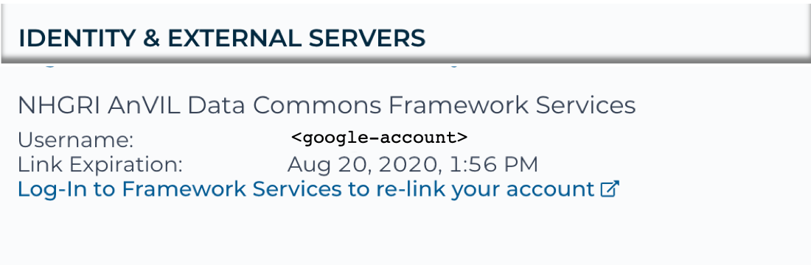

# pyAnVIL: terra + gen3

A python client integration of gen3 and terra.

For python developers, who have requirements to access both terra and gen3 platforms, pyAnVIL is an integration module that provides SSO (single sign on) using terra as an IDP (identity provider) and manages distribution of dependencies unlike juggling multiple credentials and installs, pyAnVIL provides developer friendly experience.

## Installation

Pre-requisites: 

* gcloud cli tools installed and configured [gcloud](https://cloud.google.com/sdk/install).  
* Google Id provisioned in both Terra and Gen3: 
   * One time Account Linking:
      * Pre-requisite: google account provisioned in both Gen3 and Terra.
      * Log into https://gen3.theanvil.io/
      * Log into https://anvil.terra.bio
      * In Terra, navigate to your profile
         * Under "IDENTITY & EXTERNAL SERVERS", log into `NHGRI AnVIL Data Commons Framework Services`, the system should present you with a Gen3 Oauth flow.
         * Note the google project used for billing
      
* Per instance, terra API setup:
   * Use the google account and billing project to setup credentials for the [terra api](https://github.com/broadinstitute/fiss).
      ```
        gcloud auth login <google-account>
        gcloud auth application-default set-quota-project <billing-project-id>   
      ```
* Validation

    ```
    gcloud auth print-access-token
    >>> ya29.a0AfH6SMBSPFSt252qQNl.......

    fissfc config
    >>> ....
    root_url	https://broad-bond-prod.appspot.com/   
    ```
* Setup
    ``` 
    pip install pyAnVIL
    ```

## Use cases

### SSO
```
   from anvil.gen3_auth import Gen3TerraAuth
   from gen3.submission import Gen3Submission

   auth = Gen3TerraAuth()
   gen3_endpoint = "https://gen3.theanvil.io"
   submission_client = Gen3Submission(gen3_endpoint, auth)
```


[sso sequence diagram](docs/_static/sequence-diagram.png)

#### API Wrappers

### Gen3

```
   query = '{project(first:0) {code,  subjects {submitter_id}, programs {name}  }}'
   results = submission_client.query(query)
   [p['code'] for p in results['data']['project']]
   >>> ['GTEx', '1000Genomes']
```

### Terra

```
   from anvil.terra import FAPI
   FAPI.whoami()
   >>> 'anvil.user@gmail.com'
```

### Terra utilities

```
   from anvil.terra import get_projects
   projects = get_projects(namespaces=['anvil-datastorage'], project_pattern='AnVIL_CCDG.*')
   [p['workspace']['name'] for p in projects]
   >>> ['AnVIL_CCDG_WashU_CVD_EOCAD_BioMe_WGS',
        'AnVIL_CCDG_Broad_CVD_EOCAD_TaiChi_WGS',
        'AnVIL_CCDG_Broad_AI_IBD_Brant_DS-IBD_WGS', ...]
```   

### Data Dashboard

[notebook example](docs/_static/0.0.2.ipynb)

## Contributing

 
* set up virtual env

  ```
  python3 -m venv venv
  source venv/bin/activate
  python3 -m pip install -r requirements.txt
  python3 -m pip install -r requirements-dev.txt
  ```


* test gen3 authorization

    ```
    python3 -m pytest --user_email <GMAIL ACCOUNT>  --log-level DEBUG  --gen3_endpoint <GEN3_ENDPOINT>  tests/integration/test_gen3_auth.py
    ```

* continuous integration
   * see [service account setup](https://cloud.google.com/solutions/continuous-delivery-with-travis-ci#create_a_service_account)

   ```
      # see https://github.com/broadinstitute/firecloud-tools/tree/master/scripts/register_service_account
      docker run --rm -it -v "$HOME"/.config:/.config -v /Users/walsbr/client-apis/pyAnVIL/client_secret.json:/svc.json broadinstitute/firecloud-tools python /scripts/register_service_account/register_service_account.py -j /svc.json -e  brian@bwalsh.com
      The service account pyanvil@api-project-807881269549.bwalsh.com.iam.gserviceaccount.com is now registered with FireCloud. You can share workspaces with this address, or use it to call APIs.   
   ```

## Distribution

* PyPi

```
# refresh from data ingestion tracker spread sheet, update pypi

export TWINE_USERNAME=  #  the username to use for authentication to the repository.
export TWINE_PASSWORD=  # the password to use for authentication to the repository.

rm -r dist/
python3  setup.py data_ingestion_tracker sdist bdist_wheel
twine upload dist/*
```

* Read The Docs

```
https://readthedocs.org/projects/pyanvil/
```
