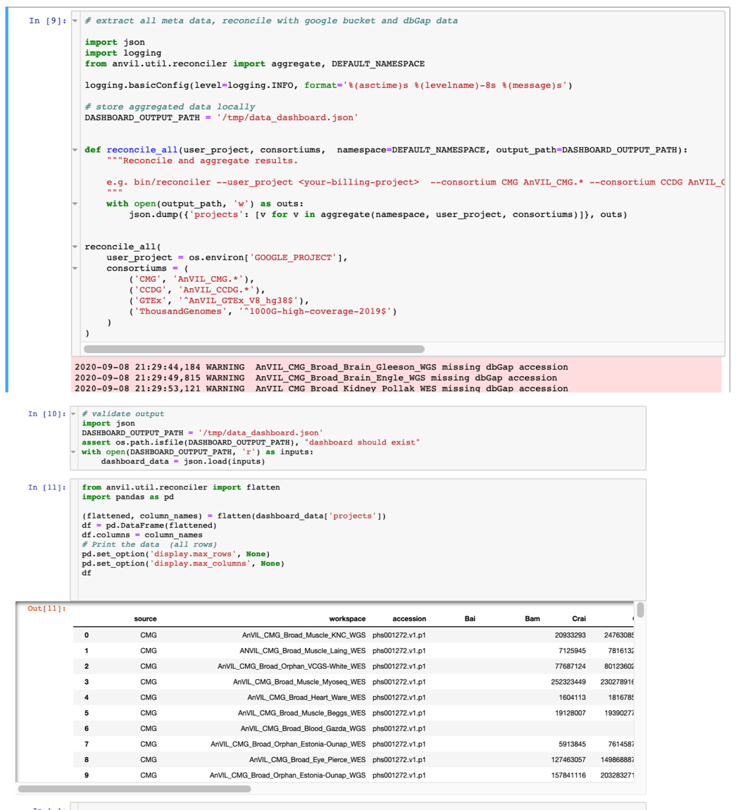

.. pyAnVIL documentation master file, created by
   sphinx-quickstart on Wed Aug 12 16:02:21 2020.
   You can adapt this file completely to your liking, but it should at least
   contain the root `toctree` directive.

pyAnVIL
========

For python developers, who have requirements to access both terra and gen3 platforms, pyAnVIL is an integration module that provides SSO (single sign on) using terra as an IDP (identity provider) and manages distribution of dependencies unlike juggling multiple credentials and installs, pyAnVIL provides developer friendly experience.

Installation
------------

Pre-requisites: 

* Google Id provisioned in both Terra and Gen3: 
   * One time Account Linking:
      * Pre-requisite: google account provisioned in both Gen3 and Terra.
      * Log into https://gen3.theanvil.io/
      * Log into https://anvil.terra.bio
      * In Terra, navigate to your profile
         * Under "IDENTITY & EXTERNAL SERVERS", log into `NHGRI AnVIL Data Commons Framework Services`, the system should present you with a Gen3 Oauth flow.
         * Note the google project used for billing

      .. image:: _static/terra-profile.png

* For standalone instances, outside of terra environment:
   gcloud cli tools installed and configured `gcloud <https://cloud.google.com/sdk/install>`_.  

   * Per instance, terra API setup:
      * Use the google account and billing project to setup credentials for the `terra api <https://github.com/broadinstitute/fiss>`_. ::

         gcloud auth login <google-account>
         gcloud auth application-default set-quota-project <billing-project-id>   

   * Validation ::

      gcloud auth print-access-token
      >>> ya29.a0AfH6SMBSPFSt252qQNl.......

      fissfc config
      >>> ....
      root_url	https://broad-bond-prod.appspot.com/   

* Setup: ::
   
   pip install pyAnVIL

Use cases
---------

SSO
###

Setup: ::

   from anvil.gen3_auth import Gen3TerraAuth
   from gen3.submission import Gen3Submission

   auth = Gen3TerraAuth()
   gen3_endpoint = "https://gen3.theanvil.io"
   submission_client = Gen3Submission(gen3_endpoint, auth)

:doc:`sso sequence diagram <diagram>` 

API wrappers
############

Gen3: ::

   query = '{project(first:0) {code,  subjects {submitter_id}, programs {name}  }}'
   results = submission_client.query(query)
   [p['code'] for p in results['data']['project']]
   >>> ['GTEx', '1000Genomes']

Terra: ::

   from anvil.terra import FAPI
   FAPI.whoami()
   >>> 'anvil.user@gmail.com'

Terra utilities: ::

   from anvil.terra import get_projects
   projects = get_projects(namespaces=['anvil-datastorage'], project_pattern='AnVIL_CCDG.*')
   [p['workspace']['name'] for p in projects]
   >>> ['AnVIL_CCDG_WashU_CVD_EOCAD_BioMe_WGS',
        'AnVIL_CCDG_Broad_CVD_EOCAD_TaiChi_WGS',
        'AnVIL_CCDG_Broad_AI_IBD_Brant_DS-IBD_WGS', ...]
   

Data Dashboard
##############

Dashboard example:

`notebook <https://github.com/anvilproject/client-apis/blob/dashboard/pyAnVIL/docs/_static/0.0.2.ipynb>`_

Roadmap
-------

Future use cases include:

* Setup google service account for travis testing
* Reconciliation of Gen3 and Terra workspace, keyed by dbGAP identifier
* FHIR

Contributing
------------

:doc:`Contribution Guide <contributing>` 

Package Index
-------------

* :doc:`auth <source/anvil_gen3>` 
* :doc:`terra <source/anvil_terra>` 
* :doc:`util <source/anvil_util>` 

.. toctree::
  :maxdepth: 2
  :hidden:
