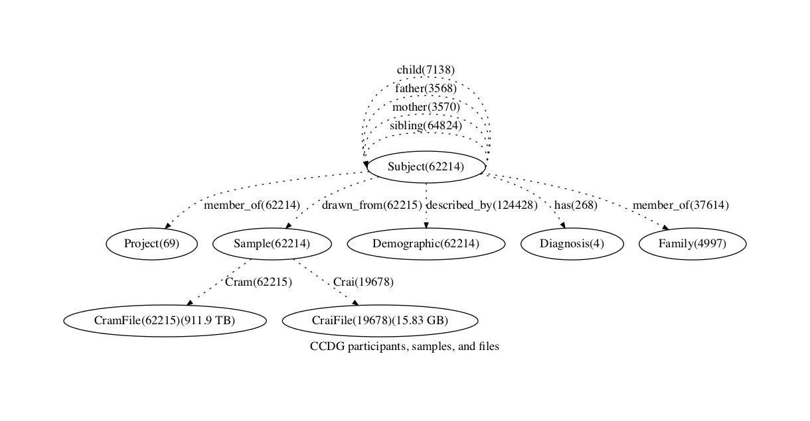
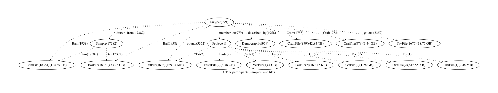

# AnVIL Summary

## Combined Graph

`Draft:` For discussion purposes, we combined [ccdg, cmg, 1000g, GTEx] and partially harmonized entities into the following graph.

### Node counts by project

<table border="1" class="dataframe">
  <thead>
    <tr style="text-align: right;">
      <th></th>
      <th></th>
      <th>BaiFile</th>
      <th>BamFile</th>
      <th>CraiFile</th>
      <th>CramFile</th>
      <th>Demographic</th>
      <th>Diagnosis</th>
      <th>Family</th>
      <th>Gene</th>
      <th>Phenotype</th>
      <th>Population</th>
      <th>Project</th>
      <th>Sample</th>
      <th>Subject</th>
      <th>TsvFile</th>
      <th>TxtFile</th>
    </tr>
    <tr>
      <th>source</th>
      <th>project_id</th>
      <th></th>
      <th></th>
      <th></th>
      <th></th>
      <th></th>
      <th></th>
      <th></th>
      <th></th>
      <th></th>
      <th></th>
      <th></th>
      <th></th>
      <th></th>
      <th></th>
      <th></th>
    </tr>
  </thead>
  <tbody>
    <tr>
      <th rowspan="51" valign="top">CCDG</th>
      <th>AnVIL_CCDG_WashU_CVD_EOCAD_BioMe_WGS</th>
      <td></td>
      <td></td>
      <td></td>
      <td>647</td>
      <td>647</td>
      <td></td>
      <td>1</td>
      <td></td>
      <td></td>
      <td></td>
      <td>1</td>
      <td>647</td>
      <td>647</td>
      <td></td>
      <td></td>
    </tr>
    <tr>
      <th>AnVIL_CCDG_Broad_CVD_EOCAD_TaiChi_WGS</th>
      <td></td>
      <td></td>
      <td>773</td>
      <td>773</td>
      <td>773</td>
      <td></td>
      <td></td>
      <td></td>
      <td></td>
      <td></td>
      <td>1</td>
      <td>773</td>
      <td>773</td>
      <td></td>
      <td></td>
    </tr>
    <tr>
      <th>AnVIL_CCDG_Broad_AI_IBD_Brant_DS-IBD_WGS</th>
      <td></td>
      <td></td>
      <td>177</td>
      <td>177</td>
      <td>177</td>
      <td></td>
      <td></td>
      <td></td>
      <td></td>
      <td></td>
      <td>1</td>
      <td>177</td>
      <td>177</td>
      <td></td>
      <td></td>
    </tr>
    <tr>
      <th>AnVIL_CCDG_WashU_AI_T1D_T1DGC_WGS</th>
      <td></td>
      <td></td>
      <td></td>
      <td>3166</td>
      <td>3166</td>
      <td></td>
      <td></td>
      <td></td>
      <td></td>
      <td></td>
      <td>1</td>
      <td>3166</td>
      <td>3166</td>
      <td></td>
      <td></td>
    </tr>
    <tr>
      <th>AnVIL_CCDG_Broad_CVD_AFib_Penn_WGS</th>
      <td></td>
      <td></td>
      <td>418</td>
      <td>418</td>
      <td>418</td>
      <td></td>
      <td></td>
      <td></td>
      <td></td>
      <td></td>
      <td>1</td>
      <td>418</td>
      <td>418</td>
      <td></td>
      <td></td>
    </tr>
    <tr>
      <th>AnVIL_CCDG_WashU_CVD_EOCAD_Harvard-Costa-Rica_WGS</th>
      <td></td>
      <td></td>
      <td></td>
      <td>2790</td>
      <td>2790</td>
      <td></td>
      <td></td>
      <td></td>
      <td></td>
      <td></td>
      <td>1</td>
      <td>2790</td>
      <td>2790</td>
      <td></td>
      <td></td>
    </tr>
    <tr>
      <th>AnVIL_CCDG_WashU_CVD_EOCAD_WashU-CAD_GRU-IRB_WGS</th>
      <td></td>
      <td></td>
      <td></td>
      <td>146</td>
      <td>146</td>
      <td></td>
      <td></td>
      <td></td>
      <td></td>
      <td></td>
      <td>1</td>
      <td>146</td>
      <td>146</td>
      <td></td>
      <td></td>
    </tr>
    <tr>
      <th>AnVIL_CCDG_Broad_CVD_EOCAD_VIRGO_WGS</th>
      <td></td>
      <td></td>
      <td>2159</td>
      <td>2159</td>
      <td>2158</td>
      <td></td>
      <td></td>
      <td></td>
      <td></td>
      <td></td>
      <td>1</td>
      <td>2158</td>
      <td>2158</td>
      <td></td>
      <td></td>
    </tr>
    <tr>
      <th>AnVIL_CCDG_Broad_CVD_AFib_AFLMU_WGS</th>
      <td></td>
      <td></td>
      <td>248</td>
      <td>248</td>
      <td>248</td>
      <td></td>
      <td></td>
      <td></td>
      <td></td>
      <td></td>
      <td>1</td>
      <td>248</td>
      <td>248</td>
      <td></td>
      <td></td>
    </tr>
    <tr>
      <th>AnVIL_CCDG_Broad_CVD_AFib_GENAF_WGS</th>
      <td></td>
      <td></td>
      <td>90</td>
      <td>90</td>
      <td>90</td>
      <td></td>
      <td></td>
      <td></td>
      <td></td>
      <td></td>
      <td>1</td>
      <td>90</td>
      <td>90</td>
      <td></td>
      <td></td>
    </tr>
    <tr>
      <th>AnVIL_CCDG_WashU_CVD_EOCAD_METSIM_WGS</th>
      <td></td>
      <td></td>
      <td></td>
      <td>3121</td>
      <td>3121</td>
      <td></td>
      <td></td>
      <td></td>
      <td></td>
      <td></td>
      <td>1</td>
      <td>3121</td>
      <td>3121</td>
      <td></td>
      <td></td>
    </tr>
    <tr>
      <th>AnVIL_CCDG_Broad_CVD_AFib_JHU_WGS</th>
      <td></td>
      <td></td>
      <td>290</td>
      <td>290</td>
      <td>290</td>
      <td></td>
      <td></td>
      <td></td>
      <td></td>
      <td></td>
      <td>1</td>
      <td>290</td>
      <td>290</td>
      <td></td>
      <td></td>
    </tr>
    <tr>
      <th>AnVIL_CCDG_Broad_CVD_AFib_MPP_WGS</th>
      <td></td>
      <td></td>
      <td>118</td>
      <td>118</td>
      <td>118</td>
      <td></td>
      <td></td>
      <td></td>
      <td></td>
      <td></td>
      <td>1</td>
      <td>118</td>
      <td>118</td>
      <td></td>
      <td></td>
    </tr>
    <tr>
      <th>AnVIL_CCDG_WashU_CVD_EOCAD_Finland-CHD_WGS</th>
      <td></td>
      <td></td>
      <td></td>
      <td>155</td>
      <td>155</td>
      <td></td>
      <td></td>
      <td></td>
      <td></td>
      <td></td>
      <td>1</td>
      <td>155</td>
      <td>155</td>
      <td></td>
      <td></td>
    </tr>
    <tr>
      <th>AnVIL_CCDG_NYGC_NP_Alz_LOAD_WGS</th>
      <td></td>
      <td></td>
      <td></td>
      <td>1049</td>
      <td>1049</td>
      <td></td>
      <td>325</td>
      <td></td>
      <td></td>
      <td></td>
      <td>1</td>
      <td>1049</td>
      <td>1049</td>
      <td></td>
      <td></td>
    </tr>
    <tr>
      <th>AnVIL_CCDG_NYGC_NP_Autism_SSC_WGS</th>
      <td></td>
      <td></td>
      <td></td>
      <td>9205</td>
      <td>9205</td>
      <td></td>
      <td>2423</td>
      <td></td>
      <td></td>
      <td></td>
      <td>1</td>
      <td>9205</td>
      <td>9205</td>
      <td></td>
      <td></td>
    </tr>
    <tr>
      <th>AnVIL_CCDG_WashU_CVD_EOCAD_Penn_WGS</th>
      <td></td>
      <td></td>
      <td></td>
      <td>1356</td>
      <td>1356</td>
      <td></td>
      <td></td>
      <td></td>
      <td></td>
      <td></td>
      <td>1</td>
      <td>1356</td>
      <td>1356</td>
      <td></td>
      <td></td>
    </tr>
    <tr>
      <th>AnVIL_CCDG_NYGC_NP_Autism_ACE2_DS-MDS_WGS</th>
      <td></td>
      <td></td>
      <td></td>
      <td>66</td>
      <td>66</td>
      <td></td>
      <td>17</td>
      <td></td>
      <td></td>
      <td></td>
      <td>1</td>
      <td>66</td>
      <td>66</td>
      <td></td>
      <td></td>
    </tr>
    <tr>
      <th>AnVIL_CCDG_Broad_CVD_AFib_MGH_WGS</th>
      <td></td>
      <td></td>
      <td>105</td>
      <td>105</td>
      <td>105</td>
      <td></td>
      <td></td>
      <td></td>
      <td></td>
      <td></td>
      <td>1</td>
      <td>105</td>
      <td>105</td>
      <td></td>
      <td></td>
    </tr>
    <tr>
      <th>AnVIL_CCDG_NYGC_AI_Asthma_Gala2_WGS</th>
      <td></td>
      <td></td>
      <td></td>
      <td>1171</td>
      <td>1171</td>
      <td></td>
      <td></td>
      <td></td>
      <td></td>
      <td></td>
      <td>1</td>
      <td>1171</td>
      <td>1171</td>
      <td></td>
      <td></td>
    </tr>
    <tr>
      <th>AnVIL_CCDG_Broad_AI_IBD_McGovern_WGS</th>
      <td></td>
      <td></td>
      <td>1565</td>
      <td>1565</td>
      <td>1565</td>
      <td></td>
      <td></td>
      <td></td>
      <td></td>
      <td></td>
      <td>1</td>
      <td>1565</td>
      <td>1565</td>
      <td></td>
      <td></td>
    </tr>
    <tr>
      <th>AnVIL_CCDG_Broad_AI_IBD_Cho_WGS</th>
      <td></td>
      <td></td>
      <td>253</td>
      <td>253</td>
      <td>253</td>
      <td></td>
      <td></td>
      <td></td>
      <td></td>
      <td></td>
      <td>1</td>
      <td>253</td>
      <td>253</td>
      <td></td>
      <td></td>
    </tr>
    <tr>
      <th>AnVIL_CCDG_NYGC_NP_Autism_SAGE_WGS</th>
      <td></td>
      <td></td>
      <td></td>
      <td>580</td>
      <td>580</td>
      <td></td>
      <td>181</td>
      <td></td>
      <td></td>
      <td></td>
      <td>1</td>
      <td>580</td>
      <td>580</td>
      <td></td>
      <td></td>
    </tr>
    <tr>
      <th>AnVIL_CCDG_Broad_AI_IBD_Newberry_WGS</th>
      <td></td>
      <td></td>
      <td>25</td>
      <td>25</td>
      <td>25</td>
      <td></td>
      <td></td>
      <td></td>
      <td></td>
      <td></td>
      <td>1</td>
      <td>25</td>
      <td>25</td>
      <td></td>
      <td></td>
    </tr>
    <tr>
      <th>AnVIL_CCDG_Baylor_CVD_HemStroke_ERICH_WGS</th>
      <td></td>
      <td></td>
      <td></td>
      <td>1358</td>
      <td>1358</td>
      <td></td>
      <td></td>
      <td></td>
      <td></td>
      <td></td>
      <td>1</td>
      <td>1358</td>
      <td>1358</td>
      <td></td>
      <td></td>
    </tr>
    <tr>
      <th>AnVIL_CCDG_NYGC_NP_Alz_EFIGA_WGS</th>
      <td></td>
      <td></td>
      <td></td>
      <td>1177</td>
      <td>1177</td>
      <td></td>
      <td>306</td>
      <td></td>
      <td></td>
      <td></td>
      <td>1</td>
      <td>1177</td>
      <td>1177</td>
      <td></td>
      <td></td>
    </tr>
    <tr>
      <th>AnVIL_CCDG_Baylor_CVD_EOCAD_SoL_WGS</th>
      <td></td>
      <td></td>
      <td></td>
      <td>3944</td>
      <td>3944</td>
      <td></td>
      <td></td>
      <td></td>
      <td></td>
      <td></td>
      <td>1</td>
      <td>3944</td>
      <td>3944</td>
      <td></td>
      <td></td>
    </tr>
    <tr>
      <th>AnVIL_CCDG_Baylor_CVD_AFib_BioVU_WGS</th>
      <td></td>
      <td></td>
      <td></td>
      <td>1122</td>
      <td>1122</td>
      <td></td>
      <td></td>
      <td></td>
      <td></td>
      <td></td>
      <td>1</td>
      <td>1122</td>
      <td>1122</td>
      <td></td>
      <td></td>
    </tr>
    <tr>
      <th>AnVIL_CCDG_Broad_NP_Autism_State-Sanders_WGS</th>
      <td></td>
      <td></td>
      <td>534</td>
      <td>534</td>
      <td>534</td>
      <td></td>
      <td></td>
      <td></td>
      <td></td>
      <td></td>
      <td>1</td>
      <td>534</td>
      <td>534</td>
      <td></td>
      <td></td>
    </tr>
    <tr>
      <th>AnVIL_CCDG_WashU_CVD_EOCAD_BioVu_WGS</th>
      <td></td>
      <td></td>
      <td></td>
      <td>624</td>
      <td>624</td>
      <td></td>
      <td></td>
      <td></td>
      <td></td>
      <td></td>
      <td>1</td>
      <td>624</td>
      <td>624</td>
      <td></td>
      <td></td>
    </tr>
    <tr>
      <th>AnVIL_CCDG_Broad_CVD_AFib_Intermountain_WGS</th>
      <td></td>
      <td></td>
      <td>464</td>
      <td>464</td>
      <td>464</td>
      <td></td>
      <td></td>
      <td></td>
      <td></td>
      <td></td>
      <td>1</td>
      <td>464</td>
      <td>464</td>
      <td></td>
      <td></td>
    </tr>
    <tr>
      <th>AnVIL_CCDG_NYGC_NP_Autism_TASC_WGS</th>
      <td></td>
      <td></td>
      <td></td>
      <td>905</td>
      <td>905</td>
      <td></td>
      <td>305</td>
      <td></td>
      <td></td>
      <td></td>
      <td>1</td>
      <td>905</td>
      <td>905</td>
      <td></td>
      <td></td>
    </tr>
    <tr>
      <th>AnVIL_CCDG_WashU_CVD_EOCAD_Emory_WGS</th>
      <td></td>
      <td></td>
      <td></td>
      <td>429</td>
      <td>429</td>
      <td></td>
      <td></td>
      <td></td>
      <td></td>
      <td></td>
      <td>1</td>
      <td>429</td>
      <td>429</td>
      <td></td>
      <td></td>
    </tr>
    <tr>
      <th>AnVIL_CCDG_Broad_CVD_AFib_UCSF_WGS</th>
      <td></td>
      <td></td>
      <td>112</td>
      <td>112</td>
      <td>112</td>
      <td></td>
      <td></td>
      <td></td>
      <td></td>
      <td></td>
      <td>1</td>
      <td>112</td>
      <td>112</td>
      <td></td>
      <td></td>
    </tr>
    <tr>
      <th>AnVIL_CCDG_Broad_AI_IBD_McCauley_WGS</th>
      <td></td>
      <td></td>
      <td>856</td>
      <td>856</td>
      <td>856</td>
      <td></td>
      <td></td>
      <td></td>
      <td></td>
      <td></td>
      <td>1</td>
      <td>856</td>
      <td>856</td>
      <td></td>
      <td></td>
    </tr>
    <tr>
      <th>AnVIL_CCDG_Broad_AI_IBD_Kugathasan_WGS</th>
      <td></td>
      <td></td>
      <td>914</td>
      <td>914</td>
      <td>914</td>
      <td></td>
      <td></td>
      <td></td>
      <td></td>
      <td></td>
      <td>1</td>
      <td>914</td>
      <td>914</td>
      <td></td>
      <td></td>
    </tr>
    <tr>
      <th>AnVIL_CCDG_NYGC_NP_Autism_ACE2_GRU-MDS_WGS</th>
      <td></td>
      <td></td>
      <td></td>
      <td>429</td>
      <td>429</td>
      <td>4</td>
      <td>121</td>
      <td></td>
      <td></td>
      <td></td>
      <td>1</td>
      <td>429</td>
      <td>429</td>
      <td></td>
      <td></td>
    </tr>
    <tr>
      <th>AnVIL_CCDG_Baylor_CVD_EOCAD_BioMe_WGS</th>
      <td></td>
      <td></td>
      <td></td>
      <td>1201</td>
      <td>1201</td>
      <td></td>
      <td></td>
      <td></td>
      <td></td>
      <td></td>
      <td>1</td>
      <td>1201</td>
      <td>1201</td>
      <td></td>
      <td></td>
    </tr>
    <tr>
      <th>AnVIL_CCDG_NYGC_NP_Alz_WHICAP_WGS</th>
      <td></td>
      <td></td>
      <td></td>
      <td>148</td>
      <td>148</td>
      <td></td>
      <td>148</td>
      <td></td>
      <td></td>
      <td></td>
      <td>1</td>
      <td>148</td>
      <td>148</td>
      <td></td>
      <td></td>
    </tr>
    <tr>
      <th>AnVIL_CCDG_WashU_CVD-NP-AI_Controls_VCControls_WGS</th>
      <td></td>
      <td></td>
      <td></td>
      <td>112</td>
      <td>112</td>
      <td></td>
      <td></td>
      <td></td>
      <td></td>
      <td></td>
      <td>1</td>
      <td>112</td>
      <td>112</td>
      <td></td>
      <td></td>
    </tr>
    <tr>
      <th>AnVIL_CCDG_NYGC_NP_Autism_HMCA_WGS</th>
      <td></td>
      <td></td>
      <td></td>
      <td>724</td>
      <td>724</td>
      <td></td>
      <td>176</td>
      <td></td>
      <td></td>
      <td></td>
      <td>1</td>
      <td>724</td>
      <td>724</td>
      <td></td>
      <td></td>
    </tr>
    <tr>
      <th>AnVIL_CCDG_Broad_CVD_EOCAD_PROMIS_WGS</th>
      <td></td>
      <td></td>
      <td>1136</td>
      <td>1136</td>
      <td>1136</td>
      <td></td>
      <td></td>
      <td></td>
      <td></td>
      <td></td>
      <td>1</td>
      <td>1136</td>
      <td>1136</td>
      <td></td>
      <td></td>
    </tr>
    <tr>
      <th>AnVIL_CCDG_Broad_CVD_AFib_Vanderbilt-Ablation_WGS</th>
      <td></td>
      <td></td>
      <td>2</td>
      <td>2</td>
      <td>2</td>
      <td></td>
      <td></td>
      <td></td>
      <td></td>
      <td></td>
      <td>1</td>
      <td>2</td>
      <td>2</td>
      <td></td>
      <td></td>
    </tr>
    <tr>
      <th>AnVIL_CCDG_Broad_AI_IBD_Brant_HMB_WGS</th>
      <td></td>
      <td></td>
      <td>904</td>
      <td>904</td>
      <td>904</td>
      <td></td>
      <td></td>
      <td></td>
      <td></td>
      <td></td>
      <td>1</td>
      <td>904</td>
      <td>904</td>
      <td></td>
      <td></td>
    </tr>
    <tr>
      <th>AnVIL_CCDG_Broad_CVD_Stroke_BRAVE_WGS</th>
      <td></td>
      <td></td>
      <td>496</td>
      <td>496</td>
      <td>496</td>
      <td></td>
      <td></td>
      <td></td>
      <td></td>
      <td></td>
      <td>1</td>
      <td>496</td>
      <td>496</td>
      <td></td>
      <td></td>
    </tr>
    <tr>
      <th>AnVIL_CCDG_WashU_CVD_EOCAD_Emerge_WGS</th>
      <td></td>
      <td></td>
      <td></td>
      <td>277</td>
      <td>277</td>
      <td></td>
      <td></td>
      <td></td>
      <td></td>
      <td></td>
      <td>1</td>
      <td>277</td>
      <td>277</td>
      <td></td>
      <td></td>
    </tr>
    <tr>
      <th>AnVIL_CCDG_WashU_CVD_EOCAD_Duke_WGS</th>
      <td></td>
      <td></td>
      <td></td>
      <td>1051</td>
      <td>1051</td>
      <td></td>
      <td></td>
      <td></td>
      <td></td>
      <td></td>
      <td>1</td>
      <td>1051</td>
      <td>1051</td>
      <td></td>
      <td></td>
    </tr>
    <tr>
      <th>AnVIL_CCDG_WashU_CVD_EOCAD_Cleveland_WGS</th>
      <td></td>
      <td></td>
      <td></td>
      <td>348</td>
      <td>348</td>
      <td></td>
      <td></td>
      <td></td>
      <td></td>
      <td></td>
      <td>1</td>
      <td>348</td>
      <td>348</td>
      <td></td>
      <td></td>
    </tr>
    <tr>
      <th>AnVIL_CCDG_Broad_CVD_AFib_Duke_WGS</th>
      <td></td>
      <td></td>
      <td>123</td>
      <td>123</td>
      <td>123</td>
      <td></td>
      <td></td>
      <td></td>
      <td></td>
      <td></td>
      <td>1</td>
      <td>123</td>
      <td>123</td>
      <td></td>
      <td></td>
    </tr>
    <tr>
      <th>AnVIL_CCDG_NYGC_NP_Autism_AGRE_WGS</th>
      <td></td>
      <td></td>
      <td></td>
      <td>4601</td>
      <td>4601</td>
      <td></td>
      <td>995</td>
      <td></td>
      <td></td>
      <td></td>
      <td>1</td>
      <td>4601</td>
      <td>4601</td>
      <td></td>
      <td></td>
    </tr>
    <tr>
      <th>AnVIL_CCDG_Baylor_CVD_AFib_Groningen_WGS</th>
      <td></td>
      <td></td>
      <td></td>
      <td>639</td>
      <td>639</td>
      <td></td>
      <td></td>
      <td></td>
      <td></td>
      <td></td>
      <td>1</td>
      <td>639</td>
      <td>639</td>
      <td></td>
      <td></td>
    </tr>
    <tr>
      <th rowspan="29" valign="top">CMG</th>
      <th>AnVIL_CMG_Broad_Muscle_KNC_WGS</th>
      <td></td>
      <td></td>
      <td>6</td>
      <td>6</td>
      <td>6</td>
      <td>6</td>
      <td></td>
      <td></td>
      <td></td>
      <td></td>
      <td>1</td>
      <td>6</td>
      <td>6</td>
      <td></td>
      <td></td>
    </tr>
    <tr>
      <th>AnVIL_CMG_Broad_Orphan_VCGS-White_WES</th>
      <td></td>
      <td></td>
      <td>283</td>
      <td>283</td>
      <td>283</td>
      <td>283</td>
      <td></td>
      <td></td>
      <td></td>
      <td></td>
      <td>1</td>
      <td>283</td>
      <td>283</td>
      <td></td>
      <td></td>
    </tr>
    <tr>
      <th>AnVIL_CMG_Broad_Muscle_Myoseq_WES</th>
      <td></td>
      <td></td>
      <td>1246</td>
      <td>1246</td>
      <td>1243</td>
      <td>222</td>
      <td></td>
      <td></td>
      <td></td>
      <td></td>
      <td>1</td>
      <td>1243</td>
      <td>1243</td>
      <td></td>
      <td></td>
    </tr>
    <tr>
      <th>AnVIL_CMG_Broad_Heart_Ware_WES</th>
      <td></td>
      <td></td>
      <td>10</td>
      <td>10</td>
      <td>10</td>
      <td>10</td>
      <td></td>
      <td></td>
      <td></td>
      <td></td>
      <td>1</td>
      <td>10</td>
      <td>10</td>
      <td></td>
      <td></td>
    </tr>
    <tr>
      <th>AnVIL_CMG_Broad_Muscle_Beggs_WES</th>
      <td></td>
      <td></td>
      <td>109</td>
      <td>109</td>
      <td>109</td>
      <td>109</td>
      <td></td>
      <td></td>
      <td></td>
      <td></td>
      <td>1</td>
      <td>109</td>
      <td>109</td>
      <td></td>
      <td></td>
    </tr>
    <tr>
      <th>AnVIL_CMG_Broad_Orphan_Estonia-Ounap_WES</th>
      <td></td>
      <td></td>
      <td>25</td>
      <td>25</td>
      <td>25</td>
      <td>25</td>
      <td></td>
      <td></td>
      <td></td>
      <td></td>
      <td>1</td>
      <td>25</td>
      <td>25</td>
      <td></td>
      <td></td>
    </tr>
    <tr>
      <th>AnVIL_CMG_Broad_Eye_Pierce_WES</th>
      <td></td>
      <td></td>
      <td>517</td>
      <td>517</td>
      <td>517</td>
      <td>516</td>
      <td></td>
      <td></td>
      <td></td>
      <td></td>
      <td>1</td>
      <td>517</td>
      <td>517</td>
      <td></td>
      <td></td>
    </tr>
    <tr>
      <th>AnVIL_CMG_Broad_Orphan_Estonia-Ounap_WGS</th>
      <td></td>
      <td></td>
      <td>104</td>
      <td>104</td>
      <td>104</td>
      <td>104</td>
      <td></td>
      <td></td>
      <td></td>
      <td></td>
      <td>1</td>
      <td>104</td>
      <td>104</td>
      <td></td>
      <td></td>
    </tr>
    <tr>
      <th>AnVIL_CMG_Broad_Muscle_Topf_WES</th>
      <td></td>
      <td></td>
      <td>169</td>
      <td>169</td>
      <td>665</td>
      <td>169</td>
      <td></td>
      <td></td>
      <td></td>
      <td></td>
      <td>1</td>
      <td>665</td>
      <td>665</td>
      <td></td>
      <td></td>
    </tr>
    <tr>
      <th>AnVIL_CMG_Broad_Blood_Sankaran_WES</th>
      <td></td>
      <td></td>
      <td>277</td>
      <td>277</td>
      <td>277</td>
      <td>277</td>
      <td></td>
      <td></td>
      <td></td>
      <td></td>
      <td>1</td>
      <td>277</td>
      <td>277</td>
      <td></td>
      <td></td>
    </tr>
    <tr>
      <th>AnVIL_CMG_Broad_Brain_Walsh_WES</th>
      <td></td>
      <td></td>
      <td>663</td>
      <td>663</td>
      <td>663</td>
      <td>663</td>
      <td></td>
      <td></td>
      <td></td>
      <td></td>
      <td>1</td>
      <td>663</td>
      <td>663</td>
      <td></td>
      <td></td>
    </tr>
    <tr>
      <th>AnVIL_CMG_Broad_Muscle_Kang_WES</th>
      <td></td>
      <td></td>
      <td>22</td>
      <td>22</td>
      <td>22</td>
      <td>21</td>
      <td></td>
      <td></td>
      <td></td>
      <td></td>
      <td>1</td>
      <td>22</td>
      <td>22</td>
      <td></td>
      <td></td>
    </tr>
    <tr>
      <th>AnVIL_CMG_Broad_Kidney_Hildebrandt_WES</th>
      <td></td>
      <td></td>
      <td>407</td>
      <td>407</td>
      <td>407</td>
      <td>407</td>
      <td></td>
      <td></td>
      <td></td>
      <td></td>
      <td>1</td>
      <td>407</td>
      <td>407</td>
      <td></td>
      <td></td>
    </tr>
    <tr>
      <th>AnVIL_CMG_Broad_Muscle_OGrady_WES</th>
      <td></td>
      <td></td>
      <td>43</td>
      <td>43</td>
      <td>43</td>
      <td>43</td>
      <td></td>
      <td></td>
      <td></td>
      <td></td>
      <td>1</td>
      <td>43</td>
      <td>43</td>
      <td></td>
      <td></td>
    </tr>
    <tr>
      <th>AnVIL_CMG_Broad_Brain_Gleeson_WES</th>
      <td></td>
      <td></td>
      <td></td>
      <td></td>
      <td>1181</td>
      <td>1181</td>
      <td></td>
      <td></td>
      <td></td>
      <td></td>
      <td>1</td>
      <td>1181</td>
      <td>1181</td>
      <td></td>
      <td></td>
    </tr>
    <tr>
      <th>AnVIL_CMG_Broad_Kidney_Hildebrandt_WGS</th>
      <td></td>
      <td></td>
      <td>25</td>
      <td>25</td>
      <td>25</td>
      <td>25</td>
      <td></td>
      <td></td>
      <td></td>
      <td></td>
      <td>1</td>
      <td>25</td>
      <td>25</td>
      <td></td>
      <td></td>
    </tr>
    <tr>
      <th>AnVIL_CMG_Broad_Orphan_Manton_WES</th>
      <td></td>
      <td></td>
      <td>268</td>
      <td>268</td>
      <td>268</td>
      <td>264</td>
      <td></td>
      <td></td>
      <td></td>
      <td></td>
      <td>1</td>
      <td>267</td>
      <td>268</td>
      <td></td>
      <td></td>
    </tr>
    <tr>
      <th>AnVIL_CMG_Broad_Heart_PCGC-Tristani_WGS</th>
      <td></td>
      <td></td>
      <td>45</td>
      <td>45</td>
      <td>45</td>
      <td>45</td>
      <td></td>
      <td></td>
      <td></td>
      <td></td>
      <td>1</td>
      <td>45</td>
      <td>45</td>
      <td></td>
      <td></td>
    </tr>
    <tr>
      <th>AnVIL_CMG_Broad_Muscle_KNC_WES</th>
      <td></td>
      <td></td>
      <td>35</td>
      <td>35</td>
      <td>44</td>
      <td>35</td>
      <td></td>
      <td></td>
      <td></td>
      <td></td>
      <td>1</td>
      <td>44</td>
      <td>44</td>
      <td></td>
      <td></td>
    </tr>
    <tr>
      <th>AnVIL_CMG_Broad_Heart_Seidman_WES</th>
      <td></td>
      <td></td>
      <td>129</td>
      <td>129</td>
      <td>129</td>
      <td>121</td>
      <td></td>
      <td></td>
      <td></td>
      <td></td>
      <td>1</td>
      <td>129</td>
      <td>129</td>
      <td></td>
      <td></td>
    </tr>
    <tr>
      <th>AnVIL_CMG_Broad_Muscle_Bonnemann_WGS</th>
      <td></td>
      <td></td>
      <td></td>
      <td></td>
      <td>32</td>
      <td>32</td>
      <td></td>
      <td></td>
      <td></td>
      <td></td>
      <td>1</td>
      <td>32</td>
      <td>32</td>
      <td></td>
      <td></td>
    </tr>
    <tr>
      <th>AnVIL_CMG_Broad_Muscle_Bonnemann_WES</th>
      <td></td>
      <td></td>
      <td>24</td>
      <td>24</td>
      <td>24</td>
      <td>24</td>
      <td></td>
      <td></td>
      <td></td>
      <td></td>
      <td>1</td>
      <td>24</td>
      <td>24</td>
      <td></td>
      <td></td>
    </tr>
    <tr>
      <th>AnVIL_CMG_Broad_Orphan_Manton_WGS</th>
      <td></td>
      <td></td>
      <td>7</td>
      <td>7</td>
      <td>7</td>
      <td>7</td>
      <td></td>
      <td></td>
      <td></td>
      <td></td>
      <td>1</td>
      <td>7</td>
      <td>7</td>
      <td></td>
      <td></td>
    </tr>
    <tr>
      <th>AnVIL_CMG_Broad_Muscle_Ravenscroft_WES</th>
      <td></td>
      <td></td>
      <td>35</td>
      <td>35</td>
      <td>35</td>
      <td>35</td>
      <td></td>
      <td></td>
      <td></td>
      <td></td>
      <td>1</td>
      <td>35</td>
      <td>35</td>
      <td></td>
      <td></td>
    </tr>
    <tr>
      <th>AnVIL_CMG_Broad_Orphan_VCGS-White_WGS</th>
      <td></td>
      <td></td>
      <td>30</td>
      <td>30</td>
      <td>30</td>
      <td>30</td>
      <td></td>
      <td></td>
      <td></td>
      <td></td>
      <td>1</td>
      <td>30</td>
      <td>30</td>
      <td></td>
      <td></td>
    </tr>
    <tr>
      <th>AnVIL_CMG_Broad_Muscle_Myoseq_WGS</th>
      <td></td>
      <td></td>
      <td></td>
      <td></td>
      <td>3</td>
      <td>3</td>
      <td></td>
      <td></td>
      <td></td>
      <td></td>
      <td>1</td>
      <td>3</td>
      <td>3</td>
      <td></td>
      <td></td>
    </tr>
    <tr>
      <th>AnVIL_CMG_Broad_Muscle_Kang_WGS</th>
      <td></td>
      <td></td>
      <td>2</td>
      <td>2</td>
      <td>2</td>
      <td>2</td>
      <td></td>
      <td></td>
      <td></td>
      <td></td>
      <td>1</td>
      <td>2</td>
      <td>2</td>
      <td></td>
      <td></td>
    </tr>
    <tr>
      <th>AnVIL_CMG_Broad_Eye_Pierce_WGS</th>
      <td></td>
      <td></td>
      <td>35</td>
      <td>35</td>
      <td>35</td>
      <td>35</td>
      <td></td>
      <td></td>
      <td></td>
      <td></td>
      <td>1</td>
      <td>35</td>
      <td>35</td>
      <td></td>
      <td></td>
    </tr>
    <tr>
      <th>cmg*</th>
      <td></td>
      <td></td>
      <td></td>
      <td></td>
      <td></td>
      <td></td>
      <td>3540</td>
      <td>341</td>
      <td>2405</td>
      <td></td>
      <td></td>
      <td></td>
      <td></td>
      <td></td>
      <td></td>
    </tr>
    <tr>
      <th>GTEx</th>
      <th>AnVIL_GTEx_V8_hg38</th>
      <td>979</td>
      <td>979</td>
      <td>879</td>
      <td>879</td>
      <td>979</td>
      <td></td>
      <td></td>
      <td></td>
      <td></td>
      <td></td>
      <td>1</td>
      <td>17382</td>
      <td>979</td>
      <td>1676</td>
      <td>1676</td>
    </tr>
    <tr>
      <th>ThousandGenomes</th>
      <th>1000G-high-coverage-2019</th>
      <td></td>
      <td></td>
      <td></td>
      <td>2504</td>
      <td></td>
      <td></td>
      <td></td>
      <td></td>
      <td></td>
      <td>26</td>
      <td>1</td>
      <td>2504</td>
      <td>2504</td>
      <td></td>
      <td></td>
    </tr>
  </tbody>
</table>

# Sources

## CCDG

## CMG

## 1000G

## GTEx

