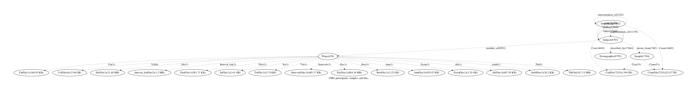

# AnVIL Summary  2020-03-26

## Combined Graph

`Draft:` For discussion purposes, we combined [ccdg, cmg, 1000g, GTEx] and partially harmonized entities into the following graph.

### Node counts by project

<table border="1" class="dataframe">
  <thead>
    <tr style="text-align: right;">
      <th></th>
      <th></th>
      <th>BaiFile</th>
      <th>BamFile</th>
      <th>CraiFile</th>
      <th>CramFile</th>
      <th>Demographic</th>
      <th>Diagnosis</th>
      <th>DictFile</th>
      <th>FaiFile</th>
      <th>Family</th>
      <th>FastaFile</th>
      <th>GtfFile</th>
      <th>Phenotype</th>
      <th>Population</th>
      <th>Project</th>
      <th>Sample</th>
      <th>Subject</th>
      <th>TbiFile</th>
      <th>TsvFile</th>
      <th>TxtFile</th>
      <th>VcfFile</th>
      <th>createdDate</th>
      <th>lastModified</th>
      <th>public</th>
      <th>size</th>
    </tr>
    <tr>
      <th>source</th>
      <th>project_id</th>
      <th></th>
      <th></th>
      <th></th>
      <th></th>
      <th></th>
      <th></th>
      <th></th>
      <th></th>
      <th></th>
      <th></th>
      <th></th>
      <th></th>
      <th></th>
      <th></th>
      <th></th>
      <th></th>
      <th></th>
      <th></th>
      <th></th>
      <th></th>
      <th></th>
      <th></th>
      <th></th>
      <th></th>
    </tr>
  </thead>
  <tbody>
    <tr>
      <th rowspan="68" valign="top">CCDG</th>
      <th>AnVIL_CCDG_WashU_CVD_EOCAD_BioMe_WGS</th>
      <td></td>
      <td></td>
      <td></td>
      <td>647</td>
      <td>647</td>
      <td></td>
      <td></td>
      <td></td>
      <td>1</td>
      <td></td>
      <td></td>
      <td></td>
      <td></td>
      <td>1</td>
      <td>647</td>
      <td>647</td>
      <td></td>
      <td></td>
      <td></td>
      <td></td>
      <td>2019-06-06T17:33:34.602Z</td>
      <td>2020-01-07T19:01:39.926Z</td>
      <td>False</td>
      <td>9.86 TB</td>
    </tr>
    <tr>
      <th>AnVIL_CCDG_Broad_CVD_EOCAD_TaiChi_WGS</th>
      <td></td>
      <td></td>
      <td>773</td>
      <td>773</td>
      <td>773</td>
      <td></td>
      <td></td>
      <td></td>
      <td></td>
      <td></td>
      <td></td>
      <td></td>
      <td></td>
      <td>1</td>
      <td>773</td>
      <td>773</td>
      <td></td>
      <td></td>
      <td></td>
      <td></td>
      <td>2019-06-06T17:33:18.715Z</td>
      <td>2020-01-07T18:36:54.738Z</td>
      <td>False</td>
      <td>14.48 TB</td>
    </tr>
    <tr>
      <th>AnVIL_CCDG_Broad_AI_IBD_Brant_DS-IBD_WGS</th>
      <td></td>
      <td></td>
      <td>177</td>
      <td>177</td>
      <td>177</td>
      <td></td>
      <td></td>
      <td></td>
      <td></td>
      <td></td>
      <td></td>
      <td></td>
      <td></td>
      <td>1</td>
      <td>177</td>
      <td>177</td>
      <td></td>
      <td></td>
      <td></td>
      <td></td>
      <td>2019-06-06T17:33:30.105Z</td>
      <td>2020-01-07T18:25:48.639Z</td>
      <td>False</td>
      <td>2.28 TB</td>
    </tr>
    <tr>
      <th>AnVIL_CCDG_WashU_AI_T1D_T1DGC_WGS</th>
      <td></td>
      <td></td>
      <td></td>
      <td>3166</td>
      <td>3166</td>
      <td></td>
      <td></td>
      <td></td>
      <td></td>
      <td></td>
      <td></td>
      <td></td>
      <td></td>
      <td>1</td>
      <td>3166</td>
      <td>3166</td>
      <td></td>
      <td></td>
      <td></td>
      <td></td>
      <td>2019-06-06T17:34:15.592Z</td>
      <td>2020-01-07T19:00:52.410Z</td>
      <td>False</td>
      <td>53.46 TB</td>
    </tr>
    <tr>
      <th>AnVIL_CCDG_Broad_NP_Epilepsy_FINKPH_EPIL_CO_MORBIDI_MDS_WES</th>
      <td></td>
      <td></td>
      <td>703</td>
      <td>703</td>
      <td>703</td>
      <td></td>
      <td></td>
      <td></td>
      <td></td>
      <td></td>
      <td></td>
      <td></td>
      <td></td>
      <td>1</td>
      <td>703</td>
      <td>703</td>
      <td></td>
      <td></td>
      <td></td>
      <td></td>
      <td>2019-12-05T14:38:47.788Z</td>
      <td>2020-01-07T18:43:57.913Z</td>
      <td>False</td>
      <td>1.19 TB</td>
    </tr>
    <tr>
      <th>AnVIL_CCDG_Broad_CVD_AFib_Penn_WGS</th>
      <td></td>
      <td></td>
      <td>418</td>
      <td>418</td>
      <td>418</td>
      <td></td>
      <td></td>
      <td></td>
      <td></td>
      <td></td>
      <td></td>
      <td></td>
      <td></td>
      <td>1</td>
      <td>418</td>
      <td>418</td>
      <td></td>
      <td></td>
      <td></td>
      <td></td>
      <td>2019-06-06T17:33:13.689Z</td>
      <td>2020-01-07T18:35:29.972Z</td>
      <td>False</td>
      <td>8.56 TB</td>
    </tr>
    <tr>
      <th>AnVIL_CCDG_Broad_NP_Epilepsy_BELULB_DS-EP-NPU_WES</th>
      <td></td>
      <td></td>
      <td>380</td>
      <td>380</td>
      <td>380</td>
      <td></td>
      <td></td>
      <td></td>
      <td></td>
      <td></td>
      <td></td>
      <td></td>
      <td></td>
      <td>1</td>
      <td>380</td>
      <td>380</td>
      <td></td>
      <td></td>
      <td></td>
      <td></td>
      <td>2019-11-21T15:33:42.324Z</td>
      <td>2020-01-07T18:40:42.557Z</td>
      <td>False</td>
      <td>626.84 GB</td>
    </tr>
    <tr>
      <th>AnVIL_CCDG_WashU_CVD_EOCAD_Harvard-Costa-Rica_WGS</th>
      <td></td>
      <td></td>
      <td></td>
      <td>2790</td>
      <td>2790</td>
      <td></td>
      <td></td>
      <td></td>
      <td></td>
      <td></td>
      <td></td>
      <td></td>
      <td></td>
      <td>1</td>
      <td>2790</td>
      <td>2790</td>
      <td></td>
      <td></td>
      <td></td>
      <td></td>
      <td>2019-06-06T17:33:44.347Z</td>
      <td>2020-01-07T19:03:58.424Z</td>
      <td>False</td>
      <td>39.81 TB</td>
    </tr>
    <tr>
      <th>AnVIL_CCDG_WashU_CVD_EOCAD_WashU-CAD_GRU-IRB_WGS</th>
      <td></td>
      <td></td>
      <td></td>
      <td>146</td>
      <td>146</td>
      <td></td>
      <td></td>
      <td></td>
      <td></td>
      <td></td>
      <td></td>
      <td></td>
      <td></td>
      <td>1</td>
      <td>146</td>
      <td>146</td>
      <td></td>
      <td></td>
      <td></td>
      <td></td>
      <td>2019-06-06T17:35:14.495Z</td>
      <td>2020-01-07T19:07:10.893Z</td>
      <td>False</td>
      <td>2.84 TB</td>
    </tr>
    <tr>
      <th>AnVIL_CCDG_Broad_CVD_EOCAD_VIRGO_WGS</th>
      <td></td>
      <td></td>
      <td>2159</td>
      <td>2159</td>
      <td>2158</td>
      <td></td>
      <td></td>
      <td></td>
      <td></td>
      <td></td>
      <td></td>
      <td></td>
      <td></td>
      <td>1</td>
      <td>2158</td>
      <td>2158</td>
      <td></td>
      <td></td>
      <td></td>
      <td></td>
      <td>2019-06-06T17:33:44.539Z</td>
      <td>2020-01-07T18:38:22.481Z</td>
      <td>False</td>
      <td>37.67 TB</td>
    </tr>
    <tr>
      <th>AnVIL_CCDG_Broad_CVD_AFib_AFLMU_WGS</th>
      <td></td>
      <td></td>
      <td>248</td>
      <td>248</td>
      <td>248</td>
      <td></td>
      <td></td>
      <td></td>
      <td></td>
      <td></td>
      <td></td>
      <td></td>
      <td></td>
      <td>1</td>
      <td>248</td>
      <td>248</td>
      <td></td>
      <td></td>
      <td></td>
      <td></td>
      <td>2019-06-06T17:33:10.164Z</td>
      <td>2020-01-07T18:32:43.983Z</td>
      <td>False</td>
      <td>4.93 TB</td>
    </tr>
    <tr>
      <th>AnVIL_CCDG_Broad_CVD_AFib_GENAF_WGS</th>
      <td></td>
      <td></td>
      <td>90</td>
      <td>90</td>
      <td>90</td>
      <td></td>
      <td></td>
      <td></td>
      <td></td>
      <td></td>
      <td></td>
      <td></td>
      <td></td>
      <td>1</td>
      <td>90</td>
      <td>90</td>
      <td></td>
      <td></td>
      <td></td>
      <td></td>
      <td>2019-06-06T17:33:14.387Z</td>
      <td>2020-01-07T18:33:19.723Z</td>
      <td>False</td>
      <td>1.87 TB</td>
    </tr>
    <tr>
      <th>AnVIL_CCDG_Broad_NP_Epilepsy_DEUUPM_HMB_MDS_WES</th>
      <td></td>
      <td></td>
      <td>112</td>
      <td>112</td>
      <td>112</td>
      <td></td>
      <td></td>
      <td></td>
      <td></td>
      <td></td>
      <td></td>
      <td></td>
      <td></td>
      <td>1</td>
      <td>112</td>
      <td>112</td>
      <td></td>
      <td></td>
      <td></td>
      <td></td>
      <td>2019-11-22T16:23:03.085Z</td>
      <td>2020-01-07T18:43:27.946Z</td>
      <td>False</td>
      <td>193.25 GB</td>
    </tr>
    <tr>
      <th>AnVIL_CCDG_WashU_CVD_EOCAD_METSIM_WGS</th>
      <td></td>
      <td></td>
      <td></td>
      <td>3121</td>
      <td>3121</td>
      <td></td>
      <td></td>
      <td></td>
      <td></td>
      <td></td>
      <td></td>
      <td></td>
      <td></td>
      <td>1</td>
      <td>3121</td>
      <td>3121</td>
      <td></td>
      <td></td>
      <td></td>
      <td></td>
      <td>2019-06-06T17:33:53.551Z</td>
      <td>2020-01-07T19:04:13.852Z</td>
      <td>False</td>
      <td>64.7 TB</td>
    </tr>
    <tr>
      <th>AnVIL_CCDG_Broad_CVD_AFib_JHU_WGS</th>
      <td></td>
      <td></td>
      <td>290</td>
      <td>290</td>
      <td>290</td>
      <td></td>
      <td></td>
      <td></td>
      <td></td>
      <td></td>
      <td></td>
      <td></td>
      <td></td>
      <td>1</td>
      <td>290</td>
      <td>290</td>
      <td></td>
      <td></td>
      <td></td>
      <td></td>
      <td>2019-06-06T17:33:26.450Z</td>
      <td>2020-01-07T18:33:56.687Z</td>
      <td>False</td>
      <td>5.45 TB</td>
    </tr>
    <tr>
      <th>AnVIL_CCDG_Broad_CVD_AFib_MPP_WGS</th>
      <td></td>
      <td></td>
      <td>118</td>
      <td>118</td>
      <td>118</td>
      <td></td>
      <td></td>
      <td></td>
      <td></td>
      <td></td>
      <td></td>
      <td></td>
      <td></td>
      <td>1</td>
      <td>118</td>
      <td>118</td>
      <td></td>
      <td></td>
      <td></td>
      <td></td>
      <td>2019-06-06T17:33:33.450Z</td>
      <td>2020-01-07T18:34:30.630Z</td>
      <td>False</td>
      <td>2.55 TB</td>
    </tr>
    <tr>
      <th>AnVIL_CCDG_WashU_CVD_EOCAD_Finland-CHD_WGS</th>
      <td></td>
      <td></td>
      <td></td>
      <td>155</td>
      <td>155</td>
      <td></td>
      <td></td>
      <td></td>
      <td></td>
      <td></td>
      <td></td>
      <td></td>
      <td></td>
      <td>1</td>
      <td>155</td>
      <td>155</td>
      <td></td>
      <td></td>
      <td></td>
      <td></td>
      <td>2019-06-06T17:34:01.641Z</td>
      <td>2020-01-07T19:03:23.320Z</td>
      <td>False</td>
      <td>3.09 TB</td>
    </tr>
    <tr>
      <th>AnVIL_CCDG_NYGC_NP_Alz_LOAD_WGS</th>
      <td></td>
      <td></td>
      <td></td>
      <td>1049</td>
      <td>1049</td>
      <td></td>
      <td></td>
      <td></td>
      <td>325</td>
      <td></td>
      <td></td>
      <td></td>
      <td></td>
      <td>1</td>
      <td>1049</td>
      <td>1049</td>
      <td></td>
      <td></td>
      <td></td>
      <td></td>
      <td>2019-06-06T17:35:03.847Z</td>
      <td>2020-01-07T18:57:02.548Z</td>
      <td>False</td>
      <td>24.49 TB</td>
    </tr>
    <tr>
      <th>AnVIL_CCDG_Broad_NP_Epilepsy_GBRSWU_CARDI_NEURO_WES</th>
      <td></td>
      <td></td>
      <td>105</td>
      <td>105</td>
      <td>105</td>
      <td></td>
      <td></td>
      <td></td>
      <td></td>
      <td></td>
      <td></td>
      <td></td>
      <td></td>
      <td>1</td>
      <td>105</td>
      <td>105</td>
      <td></td>
      <td></td>
      <td></td>
      <td></td>
      <td>2019-11-22T20:06:46.189Z</td>
      <td>2020-01-07T18:45:25.446Z</td>
      <td>False</td>
      <td>170.55 GB</td>
    </tr>
    <tr>
      <th>AnVIL_CCDG_NYGC_NP_Autism_SSC_WGS</th>
      <td></td>
      <td></td>
      <td></td>
      <td>9201</td>
      <td>9201</td>
      <td></td>
      <td></td>
      <td></td>
      <td>2422</td>
      <td></td>
      <td></td>
      <td></td>
      <td></td>
      <td>1</td>
      <td>9201</td>
      <td>9201</td>
      <td></td>
      <td></td>
      <td></td>
      <td></td>
      <td>2019-06-06T17:35:09.430Z</td>
      <td>2020-03-12T15:14:20.921Z</td>
      <td>False</td>
      <td>0 bytes</td>
    </tr>
    <tr>
      <th>AnVIL_CCDG_Broad_NP_Epilepsy_CHEUBB_HMB_IRB_MDS_WES</th>
      <td></td>
      <td></td>
      <td>7</td>
      <td>7</td>
      <td>7</td>
      <td></td>
      <td></td>
      <td></td>
      <td></td>
      <td></td>
      <td></td>
      <td></td>
      <td></td>
      <td>1</td>
      <td>7</td>
      <td>7</td>
      <td></td>
      <td></td>
      <td></td>
      <td></td>
      <td>2019-11-22T16:28:02.709Z</td>
      <td>2020-01-07T18:41:29.337Z</td>
      <td>False</td>
      <td>10.03 GB</td>
    </tr>
    <tr>
      <th>AnVIL_CCDG_WashU_CVD_EOCAD_Penn_WGS</th>
      <td></td>
      <td></td>
      <td></td>
      <td>1356</td>
      <td>1356</td>
      <td></td>
      <td></td>
      <td></td>
      <td></td>
      <td></td>
      <td></td>
      <td></td>
      <td></td>
      <td>1</td>
      <td>1356</td>
      <td>1356</td>
      <td></td>
      <td></td>
      <td></td>
      <td></td>
      <td>2019-06-06T17:34:37.791Z</td>
      <td>2020-01-07T19:06:39.191Z</td>
      <td>False</td>
      <td>27 TB</td>
    </tr>
    <tr>
      <th>AnVIL_CCDG_NYGC_NP_Autism_ACE2_DS-MDS_WGS</th>
      <td></td>
      <td></td>
      <td></td>
      <td>66</td>
      <td>66</td>
      <td></td>
      <td></td>
      <td></td>
      <td>17</td>
      <td></td>
      <td></td>
      <td></td>
      <td></td>
      <td>1</td>
      <td>66</td>
      <td>66</td>
      <td></td>
      <td></td>
      <td></td>
      <td></td>
      <td>2019-06-06T17:34:01.490Z</td>
      <td>2020-01-07T18:57:34.185Z</td>
      <td>False</td>
      <td>1.56 TB</td>
    </tr>
    <tr>
      <th>AnVIL_CCDG_Broad_CVD_AFib_MGH_WGS</th>
      <td></td>
      <td></td>
      <td>105</td>
      <td>105</td>
      <td>105</td>
      <td></td>
      <td></td>
      <td></td>
      <td></td>
      <td></td>
      <td></td>
      <td></td>
      <td></td>
      <td>1</td>
      <td>105</td>
      <td>105</td>
      <td></td>
      <td></td>
      <td></td>
      <td></td>
      <td>2019-06-06T17:33:21.193Z</td>
      <td>2020-01-07T18:34:12.971Z</td>
      <td>False</td>
      <td>2.32 TB</td>
    </tr>
    <tr>
      <th>AnVIL_CCDG_NYGC_AI_Asthma_Gala2_WGS</th>
      <td></td>
      <td></td>
      <td></td>
      <td>1171</td>
      <td>1171</td>
      <td></td>
      <td></td>
      <td></td>
      <td></td>
      <td></td>
      <td></td>
      <td></td>
      <td></td>
      <td>1</td>
      <td>1171</td>
      <td>1171</td>
      <td></td>
      <td></td>
      <td></td>
      <td></td>
      <td>2019-06-06T17:34:27.515Z</td>
      <td>2020-02-05T15:32:44.917Z</td>
      <td>False</td>
      <td>28.15 TB</td>
    </tr>
    <tr>
      <th>AnVIL_CCDG_Broad_AI_IBD_McGovern_WGS</th>
      <td></td>
      <td></td>
      <td>1565</td>
      <td>1565</td>
      <td>1565</td>
      <td></td>
      <td></td>
      <td></td>
      <td></td>
      <td></td>
      <td></td>
      <td></td>
      <td></td>
      <td>1</td>
      <td>1565</td>
      <td>1565</td>
      <td></td>
      <td></td>
      <td></td>
      <td></td>
      <td>2019-06-06T17:33:14.319Z</td>
      <td>2020-01-07T18:31:02.023Z</td>
      <td>False</td>
      <td>21.61 TB</td>
    </tr>
    <tr>
      <th>AnVIL_CCDG_Broad_NP_Epilepsy_IRLRCI_GRU_IRB_WES</th>
      <td></td>
      <td></td>
      <td>777</td>
      <td>777</td>
      <td>777</td>
      <td></td>
      <td></td>
      <td></td>
      <td></td>
      <td></td>
      <td></td>
      <td></td>
      <td></td>
      <td>1</td>
      <td>777</td>
      <td>777</td>
      <td></td>
      <td></td>
      <td></td>
      <td></td>
      <td>2019-11-27T19:24:38.907Z</td>
      <td>2020-01-07T18:46:55.952Z</td>
      <td>False</td>
      <td>1.38 TB</td>
    </tr>
    <tr>
      <th>AnVIL_CCDG_Broad_NP_Epilepsy_DEUULG_GRU_WES</th>
      <td></td>
      <td></td>
      <td>74</td>
      <td>74</td>
      <td>74</td>
      <td></td>
      <td></td>
      <td></td>
      <td></td>
      <td></td>
      <td></td>
      <td></td>
      <td></td>
      <td>1</td>
      <td>74</td>
      <td>74</td>
      <td></td>
      <td></td>
      <td></td>
      <td></td>
      <td>2019-12-02T22:03:50.122Z</td>
      <td>2020-01-07T18:43:09.553Z</td>
      <td>False</td>
      <td>121.17 GB</td>
    </tr>
    <tr>
      <th>AnVIL_CCDG_Broad_NP_Epilepsy_AUSRMB_DS-EAED-MDS_WES</th>
      <td></td>
      <td></td>
      <td>266</td>
      <td>266</td>
      <td>266</td>
      <td></td>
      <td></td>
      <td></td>
      <td></td>
      <td></td>
      <td></td>
      <td></td>
      <td></td>
      <td>1</td>
      <td>266</td>
      <td>266</td>
      <td></td>
      <td></td>
      <td></td>
      <td></td>
      <td>2019-11-21T15:57:37.643Z</td>
      <td>2020-01-07T18:40:13.012Z</td>
      <td>False</td>
      <td>439.35 GB</td>
    </tr>
    <tr>
      <th>AnVIL_CCDG_Broad_AI_IBD_Cho_WGS</th>
      <td></td>
      <td></td>
      <td>253</td>
      <td>253</td>
      <td>253</td>
      <td></td>
      <td></td>
      <td></td>
      <td></td>
      <td></td>
      <td></td>
      <td></td>
      <td></td>
      <td>1</td>
      <td>253</td>
      <td>253</td>
      <td></td>
      <td></td>
      <td></td>
      <td></td>
      <td>2019-06-06T17:33:48.272Z</td>
      <td>2020-01-07T18:26:25.787Z</td>
      <td>False</td>
      <td>4.08 TB</td>
    </tr>
    <tr>
      <th>AnVIL_CCDG_NYGC_NP_Autism_SAGE_WGS</th>
      <td></td>
      <td></td>
      <td></td>
      <td>580</td>
      <td>580</td>
      <td></td>
      <td></td>
      <td></td>
      <td>181</td>
      <td></td>
      <td></td>
      <td></td>
      <td></td>
      <td>1</td>
      <td>580</td>
      <td>580</td>
      <td></td>
      <td></td>
      <td></td>
      <td></td>
      <td>2019-06-06T17:34:25.221Z</td>
      <td>2020-01-07T18:58:48.727Z</td>
      <td>False</td>
      <td>13.91 TB</td>
    </tr>
    <tr>
      <th>AnVIL_CCDG_Broad_AI_IBD_Newberry_WGS</th>
      <td></td>
      <td></td>
      <td>25</td>
      <td>25</td>
      <td>25</td>
      <td></td>
      <td></td>
      <td></td>
      <td></td>
      <td></td>
      <td></td>
      <td></td>
      <td></td>
      <td>1</td>
      <td>25</td>
      <td>25</td>
      <td></td>
      <td></td>
      <td></td>
      <td></td>
      <td>2019-06-06T17:34:12.895Z</td>
      <td>2020-01-07T18:31:17.731Z</td>
      <td>False</td>
      <td>294.12 GB</td>
    </tr>
    <tr>
      <th>AnVIL_CCDG_Baylor_CVD_HemStroke_ERICH_WGS</th>
      <td></td>
      <td></td>
      <td></td>
      <td>1358</td>
      <td>1358</td>
      <td></td>
      <td></td>
      <td></td>
      <td></td>
      <td></td>
      <td></td>
      <td></td>
      <td></td>
      <td>1</td>
      <td>1358</td>
      <td>1358</td>
      <td></td>
      <td></td>
      <td></td>
      <td></td>
      <td>2019-06-06T17:35:15.655Z</td>
      <td>2020-01-07T18:25:08.160Z</td>
      <td>False</td>
      <td>27.44 TB</td>
    </tr>
    <tr>
      <th>AnVIL_CCDG_NYGC_NP_Alz_EFIGA_WGS</th>
      <td></td>
      <td></td>
      <td></td>
      <td>1177</td>
      <td>1177</td>
      <td></td>
      <td></td>
      <td></td>
      <td>306</td>
      <td></td>
      <td></td>
      <td></td>
      <td></td>
      <td>1</td>
      <td>1177</td>
      <td>1177</td>
      <td></td>
      <td></td>
      <td></td>
      <td></td>
      <td>2019-06-06T17:34:40.103Z</td>
      <td>2020-01-07T18:56:46.661Z</td>
      <td>False</td>
      <td>27.93 TB</td>
    </tr>
    <tr>
      <th>AnVIL_CCDG_Broad_NP_Epilepsy_ITAIGI_GRU_WES</th>
      <td></td>
      <td></td>
      <td>606</td>
      <td>606</td>
      <td>606</td>
      <td></td>
      <td></td>
      <td></td>
      <td></td>
      <td></td>
      <td></td>
      <td></td>
      <td></td>
      <td>1</td>
      <td>606</td>
      <td>606</td>
      <td></td>
      <td></td>
      <td></td>
      <td></td>
      <td>2019-11-27T19:43:12.791Z</td>
      <td>2020-01-07T18:47:48.967Z</td>
      <td>False</td>
      <td>1.07 TB</td>
    </tr>
    <tr>
      <th>AnVIL_CCDG_Baylor_CVD_EOCAD_SoL_WGS</th>
      <td></td>
      <td></td>
      <td></td>
      <td>3944</td>
      <td>3944</td>
      <td></td>
      <td></td>
      <td></td>
      <td></td>
      <td></td>
      <td></td>
      <td></td>
      <td></td>
      <td>1</td>
      <td>3944</td>
      <td>3944</td>
      <td></td>
      <td></td>
      <td></td>
      <td></td>
      <td>2019-06-06T17:34:56.435Z</td>
      <td>2020-01-07T18:24:06.181Z</td>
      <td>False</td>
      <td>102.66 TB</td>
    </tr>
    <tr>
      <th>AnVIL_CCDG_Baylor_CVD_AFib_BioVU_WGS</th>
      <td></td>
      <td></td>
      <td></td>
      <td>1122</td>
      <td>1122</td>
      <td></td>
      <td></td>
      <td></td>
      <td></td>
      <td></td>
      <td></td>
      <td></td>
      <td></td>
      <td>1</td>
      <td>1122</td>
      <td>1122</td>
      <td></td>
      <td></td>
      <td></td>
      <td></td>
      <td>2019-06-06T17:34:47.973Z</td>
      <td>2020-01-07T18:21:46.789Z</td>
      <td>False</td>
      <td>26.79 TB</td>
    </tr>
    <tr>
      <th>AnVIL_CCDG_Broad_NP_Epilepsy_FINUVH_HMB_NPU_MDS_WES</th>
      <td></td>
      <td></td>
      <td>92</td>
      <td>92</td>
      <td>92</td>
      <td></td>
      <td></td>
      <td></td>
      <td></td>
      <td></td>
      <td></td>
      <td></td>
      <td></td>
      <td>1</td>
      <td>92</td>
      <td>92</td>
      <td></td>
      <td></td>
      <td></td>
      <td></td>
      <td>2019-11-22T19:38:57.250Z</td>
      <td>2020-01-07T18:45:09.781Z</td>
      <td>False</td>
      <td>160.03 GB</td>
    </tr>
    <tr>
      <th>AnVIL_CCDG_Broad_NP_Epilepsy_CZEMTH_GRU_WES</th>
      <td></td>
      <td></td>
      <td>16</td>
      <td>16</td>
      <td>16</td>
      <td></td>
      <td></td>
      <td></td>
      <td></td>
      <td></td>
      <td></td>
      <td></td>
      <td></td>
      <td>1</td>
      <td>16</td>
      <td>16</td>
      <td></td>
      <td></td>
      <td></td>
      <td></td>
      <td>2019-11-22T16:04:59.207Z</td>
      <td>2020-01-07T18:42:02.954Z</td>
      <td>False</td>
      <td>27.2 GB</td>
    </tr>
    <tr>
      <th>AnVIL_CCDG_Broad_NP_Epilepsy_CANUTN_DS-EP_WES</th>
      <td></td>
      <td></td>
      <td>94</td>
      <td>94</td>
      <td>94</td>
      <td></td>
      <td></td>
      <td></td>
      <td></td>
      <td></td>
      <td></td>
      <td></td>
      <td></td>
      <td>1</td>
      <td>94</td>
      <td>94</td>
      <td></td>
      <td></td>
      <td></td>
      <td></td>
      <td>2019-11-21T15:42:27.275Z</td>
      <td>2020-01-07T18:40:58.039Z</td>
      <td>False</td>
      <td>187.71 GB</td>
    </tr>
    <tr>
      <th>AnVIL_CCDG_Broad_NP_Autism_State-Sanders_WGS</th>
      <td></td>
      <td></td>
      <td>534</td>
      <td>534</td>
      <td>534</td>
      <td></td>
      <td></td>
      <td></td>
      <td></td>
      <td></td>
      <td></td>
      <td></td>
      <td></td>
      <td>1</td>
      <td>534</td>
      <td>534</td>
      <td></td>
      <td></td>
      <td></td>
      <td></td>
      <td>2019-06-06T17:32:51.408Z</td>
      <td>2020-01-07T18:39:14.110Z</td>
      <td>False</td>
      <td>8.5 TB</td>
    </tr>
    <tr>
      <th>AnVIL_CCDG_Broad_NP_Epilepsy_DEUUKL_HMB_WES</th>
      <td></td>
      <td></td>
      <td>146</td>
      <td>146</td>
      <td>146</td>
      <td></td>
      <td></td>
      <td></td>
      <td></td>
      <td></td>
      <td></td>
      <td></td>
      <td></td>
      <td>1</td>
      <td>146</td>
      <td>146</td>
      <td></td>
      <td></td>
      <td></td>
      <td></td>
      <td>2019-11-22T19:51:39.573Z</td>
      <td>2020-01-07T18:42:53.830Z</td>
      <td>False</td>
      <td>293.97 GB</td>
    </tr>
    <tr>
      <th>AnVIL_CCDG_WashU_CVD_EOCAD_BioVu_WGS</th>
      <td></td>
      <td></td>
      <td></td>
      <td>624</td>
      <td>624</td>
      <td></td>
      <td></td>
      <td></td>
      <td></td>
      <td></td>
      <td></td>
      <td></td>
      <td></td>
      <td>1</td>
      <td>624</td>
      <td>624</td>
      <td></td>
      <td></td>
      <td></td>
      <td></td>
      <td>2019-06-06T17:33:48.412Z</td>
      <td>2020-01-07T19:01:54.639Z</td>
      <td>False</td>
      <td>11.95 TB</td>
    </tr>
    <tr>
      <th>AnVIL_CCDG_Broad_NP_Epilepsy_DEUUKB_HMB_NPU_MDS_WES</th>
      <td></td>
      <td></td>
      <td>958</td>
      <td>958</td>
      <td>958</td>
      <td></td>
      <td></td>
      <td></td>
      <td></td>
      <td></td>
      <td></td>
      <td></td>
      <td></td>
      <td>1</td>
      <td>958</td>
      <td>958</td>
      <td></td>
      <td></td>
      <td></td>
      <td></td>
      <td>2019-12-02T16:32:13.380Z</td>
      <td>2020-01-07T18:42:20.346Z</td>
      <td>False</td>
      <td>1.61 TB</td>
    </tr>
    <tr>
      <th>AnVIL_CCDG_Broad_NP_Epilepsy_CYPCYP_HMB_NPU_MDS_WES</th>
      <td></td>
      <td></td>
      <td>116</td>
      <td>116</td>
      <td>116</td>
      <td></td>
      <td></td>
      <td></td>
      <td></td>
      <td></td>
      <td></td>
      <td></td>
      <td></td>
      <td>1</td>
      <td>116</td>
      <td>116</td>
      <td></td>
      <td></td>
      <td></td>
      <td></td>
      <td>2019-11-22T15:58:16.811Z</td>
      <td>2020-01-07T18:41:44.407Z</td>
      <td>False</td>
      <td>210.2 GB</td>
    </tr>
    <tr>
      <th>AnVIL_CCDG_Broad_CVD_AFib_Intermountain_WGS</th>
      <td></td>
      <td></td>
      <td>464</td>
      <td>464</td>
      <td>464</td>
      <td></td>
      <td></td>
      <td></td>
      <td></td>
      <td></td>
      <td></td>
      <td></td>
      <td></td>
      <td>1</td>
      <td>464</td>
      <td>464</td>
      <td></td>
      <td></td>
      <td></td>
      <td></td>
      <td>2019-06-06T17:33:29.951Z</td>
      <td>2020-01-07T18:33:38.842Z</td>
      <td>False</td>
      <td>9.07 TB</td>
    </tr>
    <tr>
      <th>AnVIL_CCDG_NYGC_NP_Autism_TASC_WGS</th>
      <td></td>
      <td></td>
      <td></td>
      <td>905</td>
      <td>905</td>
      <td></td>
      <td></td>
      <td></td>
      <td>305</td>
      <td></td>
      <td></td>
      <td></td>
      <td></td>
      <td>1</td>
      <td>905</td>
      <td>905</td>
      <td></td>
      <td></td>
      <td></td>
      <td></td>
      <td>2019-06-06T17:34:46.571Z</td>
      <td>2020-01-07T18:59:17.421Z</td>
      <td>False</td>
      <td>22.82 TB</td>
    </tr>
    <tr>
      <th>AnVIL_CCDG_WashU_CVD_EOCAD_Emory_WGS</th>
      <td></td>
      <td></td>
      <td></td>
      <td>429</td>
      <td>429</td>
      <td></td>
      <td></td>
      <td></td>
      <td></td>
      <td></td>
      <td></td>
      <td></td>
      <td></td>
      <td>1</td>
      <td>429</td>
      <td>429</td>
      <td></td>
      <td></td>
      <td></td>
      <td></td>
      <td>2019-06-06T17:34:04.347Z</td>
      <td>2020-01-07T19:03:10.665Z</td>
      <td>False</td>
      <td>8.77 TB</td>
    </tr>
    <tr>
      <th>AnVIL_CCDG_Broad_CVD_AFib_UCSF_WGS</th>
      <td></td>
      <td></td>
      <td>112</td>
      <td>112</td>
      <td>112</td>
      <td></td>
      <td></td>
      <td></td>
      <td></td>
      <td></td>
      <td></td>
      <td></td>
      <td></td>
      <td>1</td>
      <td>112</td>
      <td>112</td>
      <td></td>
      <td></td>
      <td></td>
      <td></td>
      <td>2019-06-06T17:33:28.055Z</td>
      <td>2020-01-07T18:35:46.260Z</td>
      <td>False</td>
      <td>2.41 TB</td>
    </tr>
    <tr>
      <th>AnVIL_CCDG_Broad_AI_IBD_McCauley_WGS</th>
      <td></td>
      <td></td>
      <td>1087</td>
      <td>1087</td>
      <td>1087</td>
      <td></td>
      <td></td>
      <td></td>
      <td></td>
      <td></td>
      <td></td>
      <td></td>
      <td></td>
      <td>1</td>
      <td>1087</td>
      <td>1087</td>
      <td></td>
      <td></td>
      <td></td>
      <td></td>
      <td>2019-06-06T17:33:44.626Z</td>
      <td>2020-03-02T16:51:00.438Z</td>
      <td>False</td>
      <td>12.62 TB</td>
    </tr>
    <tr>
      <th>AnVIL_CCDG_Broad_AI_IBD_Kugathasan_WGS</th>
      <td></td>
      <td></td>
      <td>1348</td>
      <td>1348</td>
      <td>1348</td>
      <td></td>
      <td></td>
      <td></td>
      <td></td>
      <td></td>
      <td></td>
      <td></td>
      <td></td>
      <td>1</td>
      <td>1348</td>
      <td>1348</td>
      <td></td>
      <td></td>
      <td></td>
      <td></td>
      <td>2019-06-06T17:33:55.309Z</td>
      <td>2020-02-06T15:13:18.014Z</td>
      <td>False</td>
      <td>16.54 TB</td>
    </tr>
    <tr>
      <th>AnVIL_CCDG_NYGC_NP_Autism_ACE2_GRU-MDS_WGS</th>
      <td></td>
      <td></td>
      <td></td>
      <td>429</td>
      <td>429</td>
      <td>4</td>
      <td></td>
      <td></td>
      <td>121</td>
      <td></td>
      <td></td>
      <td></td>
      <td></td>
      <td>1</td>
      <td>429</td>
      <td>429</td>
      <td></td>
      <td></td>
      <td></td>
      <td></td>
      <td>2019-06-06T17:34:11.020Z</td>
      <td>2020-01-07T18:58:01.450Z</td>
      <td>False</td>
      <td>10.33 TB</td>
    </tr>
    <tr>
      <th>AnVIL_CCDG_Baylor_CVD_EOCAD_BioMe_WGS</th>
      <td></td>
      <td></td>
      <td></td>
      <td>1201</td>
      <td>1201</td>
      <td></td>
      <td></td>
      <td></td>
      <td></td>
      <td></td>
      <td></td>
      <td></td>
      <td></td>
      <td>1</td>
      <td>1201</td>
      <td>1201</td>
      <td></td>
      <td></td>
      <td></td>
      <td></td>
      <td>2019-06-06T17:34:51.854Z</td>
      <td>2020-01-07T18:23:49.828Z</td>
      <td>False</td>
      <td>26.23 TB</td>
    </tr>
    <tr>
      <th>AnVIL_CCDG_Broad_NP_Epilepsy_HRVUZG_HMB_MDS_WES</th>
      <td></td>
      <td></td>
      <td>14</td>
      <td>14</td>
      <td>14</td>
      <td></td>
      <td></td>
      <td></td>
      <td></td>
      <td></td>
      <td></td>
      <td></td>
      <td></td>
      <td>1</td>
      <td>14</td>
      <td>14</td>
      <td></td>
      <td></td>
      <td></td>
      <td></td>
      <td>2019-11-22T20:59:37.180Z</td>
      <td>2020-01-07T18:46:40.475Z</td>
      <td>False</td>
      <td>23.41 GB</td>
    </tr>
    <tr>
      <th>AnVIL_CCDG_NYGC_NP_Alz_WHICAP_WGS</th>
      <td></td>
      <td></td>
      <td></td>
      <td>148</td>
      <td>148</td>
      <td></td>
      <td></td>
      <td></td>
      <td>148</td>
      <td></td>
      <td></td>
      <td></td>
      <td></td>
      <td>1</td>
      <td>148</td>
      <td>148</td>
      <td></td>
      <td></td>
      <td></td>
      <td></td>
      <td>2019-06-06T17:34:25.037Z</td>
      <td>2020-01-07T18:57:18.584Z</td>
      <td>False</td>
      <td>3.65 TB</td>
    </tr>
    <tr>
      <th>AnVIL_CCDG_WashU_CVD-NP-AI_Controls_VCControls_WGS</th>
      <td></td>
      <td></td>
      <td></td>
      <td>112</td>
      <td>112</td>
      <td></td>
      <td></td>
      <td></td>
      <td></td>
      <td></td>
      <td></td>
      <td></td>
      <td></td>
      <td>1</td>
      <td>112</td>
      <td>112</td>
      <td></td>
      <td></td>
      <td></td>
      <td></td>
      <td>2019-06-06T17:34:33.847Z</td>
      <td>2020-01-07T19:01:07.827Z</td>
      <td>False</td>
      <td>0 bytes</td>
    </tr>
    <tr>
      <th>AnVIL_CCDG_NYGC_NP_Autism_HMCA_WGS</th>
      <td></td>
      <td></td>
      <td></td>
      <td>724</td>
      <td>724</td>
      <td></td>
      <td></td>
      <td></td>
      <td>176</td>
      <td></td>
      <td></td>
      <td></td>
      <td></td>
      <td>1</td>
      <td>724</td>
      <td>724</td>
      <td></td>
      <td></td>
      <td></td>
      <td></td>
      <td>2019-06-06T17:34:25.284Z</td>
      <td>2020-01-07T18:58:32.951Z</td>
      <td>False</td>
      <td>17.22 TB</td>
    </tr>
    <tr>
      <th>AnVIL_CCDG_Broad_CVD_EOCAD_PROMIS_WGS</th>
      <td></td>
      <td></td>
      <td>1136</td>
      <td>1136</td>
      <td>1136</td>
      <td></td>
      <td></td>
      <td></td>
      <td></td>
      <td></td>
      <td></td>
      <td></td>
      <td></td>
      <td>1</td>
      <td>1136</td>
      <td>1136</td>
      <td></td>
      <td></td>
      <td></td>
      <td></td>
      <td>2019-06-06T17:34:17.464Z</td>
      <td>2020-01-07T18:36:39.279Z</td>
      <td>False</td>
      <td>15.58 TB</td>
    </tr>
    <tr>
      <th>AnVIL_CCDG_Broad_CVD_AFib_Vanderbilt-Ablation_WGS</th>
      <td></td>
      <td></td>
      <td>2</td>
      <td>2</td>
      <td>2</td>
      <td></td>
      <td></td>
      <td></td>
      <td></td>
      <td></td>
      <td></td>
      <td></td>
      <td></td>
      <td>1</td>
      <td>2</td>
      <td>2</td>
      <td></td>
      <td></td>
      <td></td>
      <td></td>
      <td>2019-05-30T17:47:12.234Z</td>
      <td>2020-01-07T18:36:01.430Z</td>
      <td>False</td>
      <td>39.81 GB</td>
    </tr>
    <tr>
      <th>AnVIL_CCDG_Broad_AI_IBD_Brant_HMB_WGS</th>
      <td></td>
      <td></td>
      <td>904</td>
      <td>904</td>
      <td>904</td>
      <td></td>
      <td></td>
      <td></td>
      <td></td>
      <td></td>
      <td></td>
      <td></td>
      <td></td>
      <td>1</td>
      <td>904</td>
      <td>904</td>
      <td></td>
      <td></td>
      <td></td>
      <td></td>
      <td>2019-06-06T17:33:46.577Z</td>
      <td>2020-01-07T18:26:09.434Z</td>
      <td>False</td>
      <td>11.94 TB</td>
    </tr>
    <tr>
      <th>AnVIL_CCDG_Broad_CVD_Stroke_BRAVE_WGS</th>
      <td></td>
      <td></td>
      <td>496</td>
      <td>496</td>
      <td>496</td>
      <td></td>
      <td></td>
      <td></td>
      <td></td>
      <td></td>
      <td></td>
      <td></td>
      <td></td>
      <td>1</td>
      <td>496</td>
      <td>496</td>
      <td></td>
      <td></td>
      <td></td>
      <td></td>
      <td>2019-06-06T17:33:13.035Z</td>
      <td>2020-01-07T18:38:37.764Z</td>
      <td>False</td>
      <td>6.17 TB</td>
    </tr>
    <tr>
      <th>AnVIL_CCDG_WashU_CVD_EOCAD_Emerge_WGS</th>
      <td></td>
      <td></td>
      <td></td>
      <td>277</td>
      <td>277</td>
      <td></td>
      <td></td>
      <td></td>
      <td></td>
      <td></td>
      <td></td>
      <td></td>
      <td></td>
      <td>1</td>
      <td>277</td>
      <td>277</td>
      <td></td>
      <td></td>
      <td></td>
      <td></td>
      <td>2019-06-06T17:33:44.293Z</td>
      <td>2020-01-07T19:02:57.168Z</td>
      <td>False</td>
      <td>5.52 TB</td>
    </tr>
    <tr>
      <th>AnVIL_CCDG_WashU_CVD_EOCAD_Duke_WGS</th>
      <td></td>
      <td></td>
      <td></td>
      <td>1051</td>
      <td>1051</td>
      <td></td>
      <td></td>
      <td></td>
      <td></td>
      <td></td>
      <td></td>
      <td></td>
      <td></td>
      <td>1</td>
      <td>1051</td>
      <td>1051</td>
      <td></td>
      <td></td>
      <td></td>
      <td></td>
      <td>2019-06-06T17:34:12.676Z</td>
      <td>2020-01-07T19:02:41.936Z</td>
      <td>False</td>
      <td>21.83 TB</td>
    </tr>
    <tr>
      <th>AnVIL_CCDG_WashU_CVD_EOCAD_Cleveland_WGS</th>
      <td></td>
      <td></td>
      <td></td>
      <td>348</td>
      <td>348</td>
      <td></td>
      <td></td>
      <td></td>
      <td></td>
      <td></td>
      <td></td>
      <td></td>
      <td></td>
      <td>1</td>
      <td>348</td>
      <td>348</td>
      <td></td>
      <td></td>
      <td></td>
      <td></td>
      <td>2019-06-06T17:34:01.306Z</td>
      <td>2020-01-07T19:02:24.722Z</td>
      <td>False</td>
      <td>6.89 TB</td>
    </tr>
    <tr>
      <th>AnVIL_CCDG_Broad_CVD_AFib_Duke_WGS</th>
      <td></td>
      <td></td>
      <td>123</td>
      <td>123</td>
      <td>123</td>
      <td></td>
      <td></td>
      <td></td>
      <td></td>
      <td></td>
      <td></td>
      <td></td>
      <td></td>
      <td>1</td>
      <td>123</td>
      <td>123</td>
      <td></td>
      <td></td>
      <td></td>
      <td></td>
      <td>2019-06-06T17:33:39.324Z</td>
      <td>2020-01-07T18:32:59.549Z</td>
      <td>False</td>
      <td>2.56 TB</td>
    </tr>
    <tr>
      <th>AnVIL_CCDG_NYGC_NP_Autism_AGRE_WGS</th>
      <td></td>
      <td></td>
      <td></td>
      <td>4601</td>
      <td>4601</td>
      <td></td>
      <td></td>
      <td></td>
      <td>995</td>
      <td></td>
      <td></td>
      <td></td>
      <td></td>
      <td>1</td>
      <td>4601</td>
      <td>4601</td>
      <td></td>
      <td></td>
      <td></td>
      <td></td>
      <td>2019-06-06T17:34:33.147Z</td>
      <td>2020-01-07T18:58:17.368Z</td>
      <td>False</td>
      <td>106.07 TB</td>
    </tr>
    <tr>
      <th>AnVIL_CCDG_Baylor_CVD_AFib_Groningen_WGS</th>
      <td></td>
      <td></td>
      <td></td>
      <td>639</td>
      <td>639</td>
      <td></td>
      <td></td>
      <td></td>
      <td></td>
      <td></td>
      <td></td>
      <td></td>
      <td></td>
      <td>1</td>
      <td>639</td>
      <td>639</td>
      <td></td>
      <td></td>
      <td></td>
      <td></td>
      <td>2019-06-06T17:34:17.299Z</td>
      <td>2020-01-07T18:22:57.496Z</td>
      <td>False</td>
      <td>13.92 TB</td>
    </tr>
    <tr>
      <th>AnVIL_CCDG_Broad_NP_Epilepsy_ITAICB_HMB_NPU_MDS_WES</th>
      <td></td>
      <td></td>
      <td>244</td>
      <td>244</td>
      <td>244</td>
      <td></td>
      <td></td>
      <td></td>
      <td></td>
      <td></td>
      <td></td>
      <td></td>
      <td></td>
      <td>1</td>
      <td>244</td>
      <td>244</td>
      <td></td>
      <td></td>
      <td></td>
      <td></td>
      <td>2019-11-27T19:34:38.459Z</td>
      <td>2020-01-07T18:47:11.086Z</td>
      <td>False</td>
      <td>403.85 GB</td>
    </tr>
    <tr>
      <th rowspan="2" valign="top">CMG</th>
      <th>AnVIL_CMG_Broad_Muscle_KNC_WGS</th>
      <td></td>
      <td></td>
      <td>6</td>
      <td>6</td>
      <td>6</td>
      <td>6</td>
      <td></td>
      <td></td>
      <td></td>
      <td></td>
      <td></td>
      <td></td>
      <td></td>
      <td>1</td>
      <td>6</td>
      <td>6</td>
      <td></td>
      <td></td>
      <td></td>
      <td></td>
      <td>2019-06-06T17:33:03.378Z</td>
      <td>2020-01-07T19:17:14.835Z</td>
      <td>False</td>
      <td>118.56 GB</td>
    </tr>
    <tr>
      <th>cmg*</th>
      <td></td>
      <td></td>
      <td></td>
      <td></td>
      <td></td>
      <td></td>
      <td></td>
      <td></td>
      <td>3</td>
      <td></td>
      <td></td>
      <td>5</td>
      <td></td>
      <td></td>
      <td></td>
      <td></td>
      <td></td>
      <td></td>
      <td></td>
      <td></td>
      <td></td>
      <td></td>
      <td></td>
      <td>0 bytes</td>
    </tr>
    <tr>
      <th>GTEx</th>
      <th>AnVIL_GTEx_V8_hg38</th>
      <td>18361</td>
      <td>18361</td>
      <td>879</td>
      <td>879</td>
      <td>979</td>
      <td></td>
      <td>2</td>
      <td>2</td>
      <td></td>
      <td>2</td>
      <td>2</td>
      <td></td>
      <td></td>
      <td>1</td>
      <td>17382</td>
      <td>979</td>
      <td>1</td>
      <td>1676</td>
      <td>1678</td>
      <td>1</td>
      <td>2019-05-23T17:17:00.849Z</td>
      <td>2020-01-07T19:38:56.436Z</td>
      <td>False</td>
      <td>157.64 TB</td>
    </tr>
    <tr>
      <th>ThousandGenomes</th>
      <th>1000G-high-coverage-2019</th>
      <td></td>
      <td></td>
      <td></td>
      <td>2504</td>
      <td></td>
      <td></td>
      <td></td>
      <td></td>
      <td></td>
      <td></td>
      <td></td>
      <td></td>
      <td>26</td>
      <td>1</td>
      <td>2504</td>
      <td>2504</td>
      <td></td>
      <td></td>
      <td></td>
      <td></td>
      <td>2019-02-22T19:11:11.069Z</td>
      <td>2020-01-15T18:54:51.510Z</td>
      <td>True</td>
      <td>41.29 TB</td>
    </tr>
    <tr>
      <th>eMERGE</th>
      <th>AnVIL_CCDG_WashU_CVD_EOCAD_Emerge_WGS</th>
      <td></td>
      <td></td>
      <td></td>
      <td>277</td>
      <td></td>
      <td></td>
      <td></td>
      <td></td>
      <td></td>
      <td></td>
      <td></td>
      <td></td>
      <td></td>
      <td>1</td>
      <td>1</td>
      <td>277</td>
      <td></td>
      <td></td>
      <td></td>
      <td></td>
      <td>2019-06-06T17:33:44.293Z</td>
      <td>2020-01-07T19:02:57.168Z</td>
      <td>False</td>
      <td>5.52 TB</td>
    </tr>
  </tbody>
</table>

# Sources

## CCDG

## CMG

## 1000G

## GTEx

## Sample attributes

* [sample attributes](sample_attributes.png)
* [sample projects](sample_projects.png)

## Workspace attributes

* [workspace attributes](workspace_attributes.png)
* [workspace projects](workspace_projects.png)
